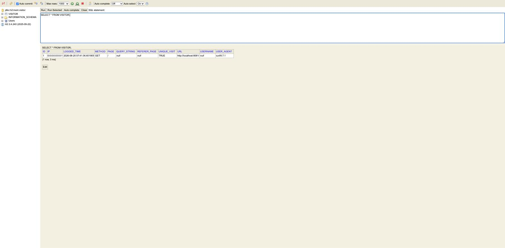

# spring-boot-online-visitor-tracker

[](https://github.com/hendisantika/spring-boot-online-visitor-tracker/actions/workflows/maven.yml)

A small Spring Boot application that logs every incoming HTTP request (IP, method, URL, referer, user agent,
authenticated user, etc.) into an H2 database via a `HandlerInterceptor`, secured with Spring Security.


## Tech Stack

- Java 25
- Spring Boot 4.1.1
- Spring Security 7
- Spring Data JPA + Hibernate
- H2 (in-memory database + web console)
- Lombok
- Maven

## Requirements

- JDK 25+
- Maven (or use the bundled `./mvnw` wrapper)

## Running the app

```bash
./mvnw spring-boot:run
```

The app starts on **http://localhost:8081**.

## Endpoints

| Method | Path             | Auth required | Description                                   |
|--------|------------------|----------------|------------------------------------------------|
| GET    | `/`              | No             | Welcome message                                |
| GET    | `/hello/{name}`  | No             | Greets `{name}`                                |
| GET    | `/login`         | Yes (Basic)    | Sample secured endpoint                        |
| GET    | `/h2-console/`   | No             | H2 web console (browse the `visitor` table)    |

Default credentials for secured endpoints: `naruto` / `roy`.

Every request (whether it succeeds or returns 401) is captured by `VisitorLogger` and persisted to the `visitor`
table so you can inspect visitor activity through the H2 console.

## H2 Console

Open [http://localhost:8081/h2-console/](http://localhost:8081/h2-console/) and connect with:

- JDBC URL: `jdbc:h2:mem:visitor`
- Username: `naruto`
- Password: `naruto`



## Building & Testing

```bash
./mvnw clean package
```

## Continuous Integration

Every push/PR to `main` is built with Maven on JDK 25 via [GitHub Actions](.github/workflows/maven.yml).
